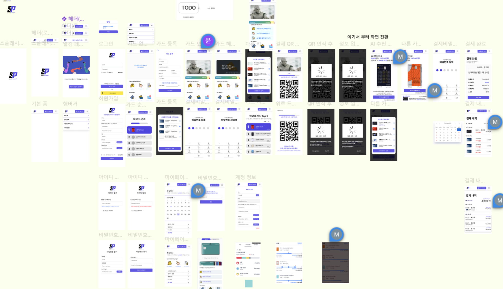
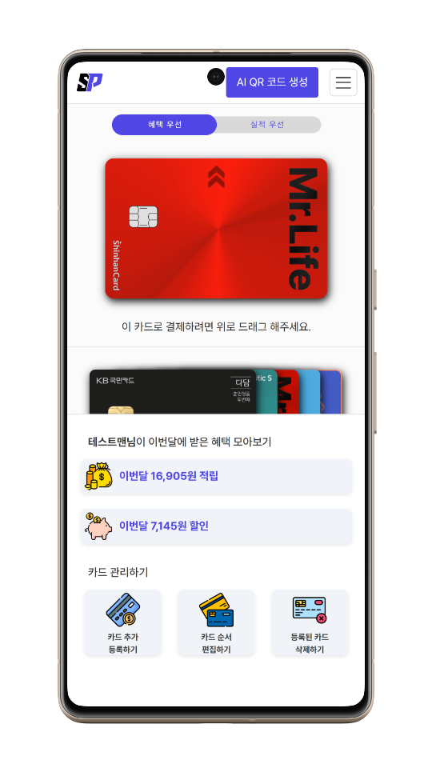
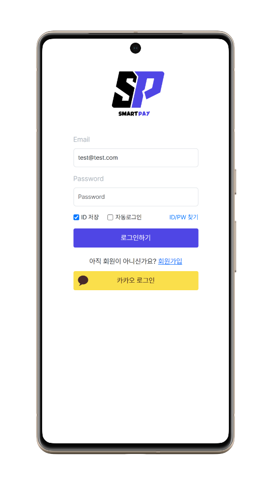
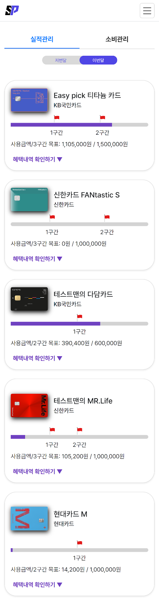
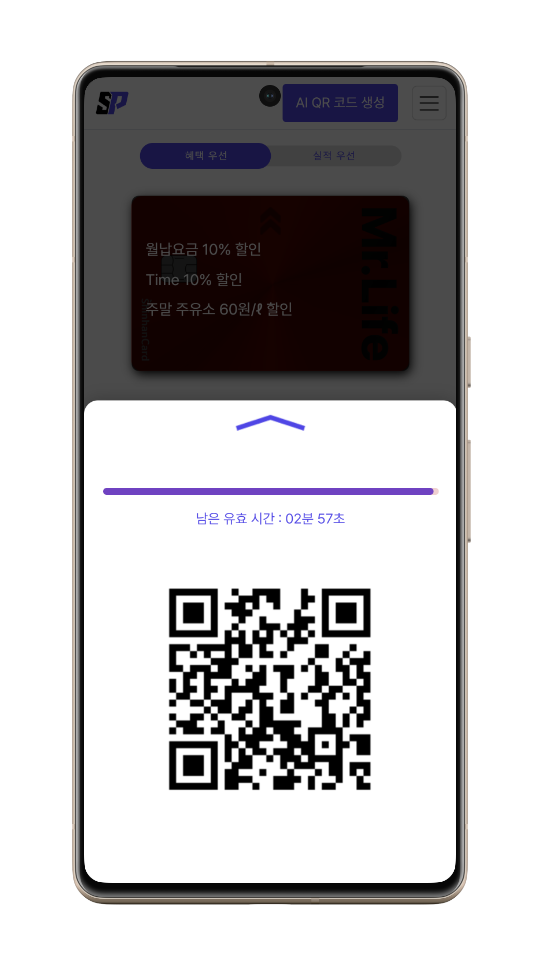
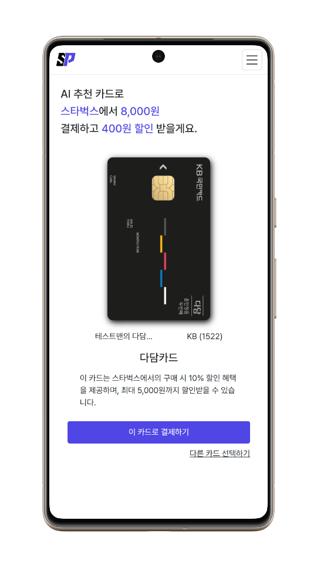
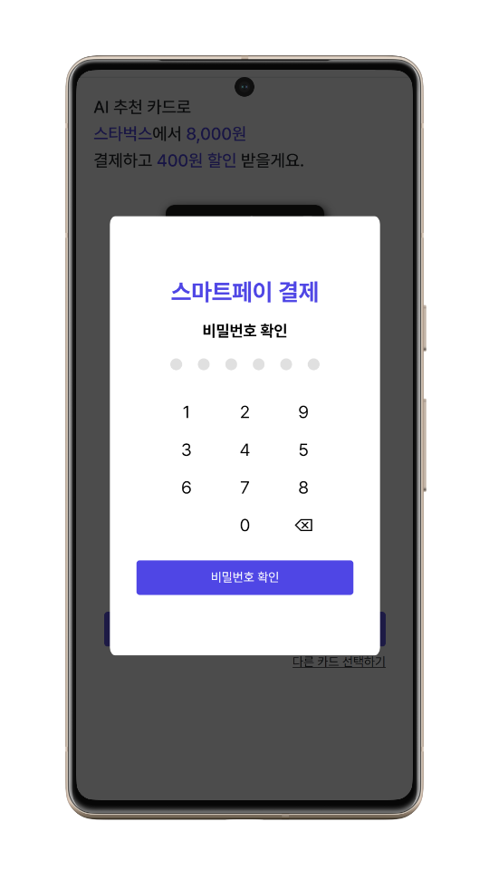
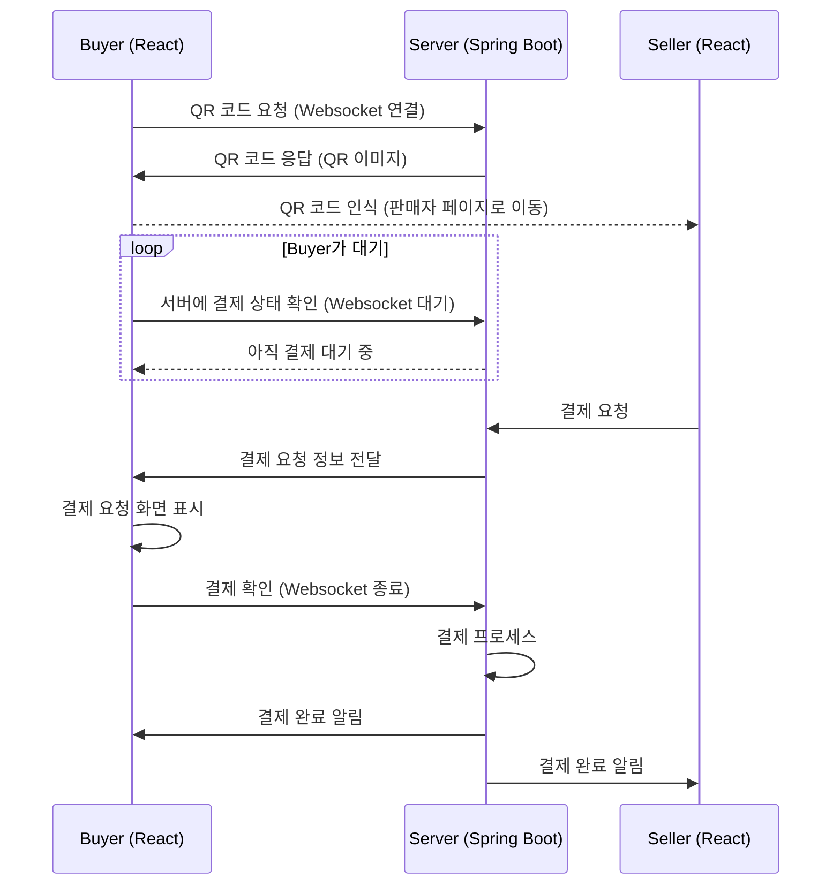

# Smartpay

<p align="left">
  <a href="https://skillicons.dev">
    
  </a>
</p>
<p align="left">
  <a href="https://skillicons.dev">
    
  </a>
</p>
<p align="left">
  <a href="https://skillicons.dev">
    
  </a>
</p>
</p>
<p align="left">
  <a href="https://skillicons.dev">
    
  </a>
</p>

## 목차
1. [프로젝트 구조](#1-프로젝트-구조)
2. [ERD](#2-erd)
3. [프로젝트 설명](#3-프로젝트-설명)
4. [결제 프로세스](#4-결제-프로세스)
5. [AI 프로세스](#5-ai-프로세스)


# Front-Smartpay
<p align="left">
  <a href="https://skillicons.dev">
    
  </a>
</p>
<p align="left">
  <a href="https://skillicons.dev">
    
  </a>
</p>
<p align="left">
  <a href="https://skillicons.dev">
    
  </a>
</p>
</p>
<p align="left">
  <a href="https://skillicons.dev">
    
  </a>
</p>

## 목차
1. [프로젝트 구조](#1-프로젝트-구조)
2. [프로젝트 목표](#2-프로젝트-목표)
3. [프로젝트 설명](#3-화면-설명)
4. [ERD](#4-erd)
5. [프로젝트 설명](#5-프로젝트-설명)
6. [결제 프로세스](#6-결제-프로세스)
7. [AI 프로세스](#7-ai-프로세스)


## 1. 프로젝트 구조

백앤드 - https://github.com/DS-TEAM11/smartpay
프론트앤드 - https://github.com/DS-TEAM11/front-smartpay


### (1) 폴더 구조
```
smartpay
 ┣ config
 ┃ ┣ ChatGptClientConfig.java
 ┃ ┣ RedisConfig.java
 ┃ ┣ SecurityConfig.java
 ┃ ┣ WebClientConfig.java
 ┃ ┣ WebConfig.java
 ┃ ┗ WebSocketConfig.java
 ┣ controller
 ┃ ┣ BinController.java
 ┃ ┣ CardController.java
 ┃ ┣ ChatGptController.java
 ┃ ┣ MemberController.java
 ┃ ┣ PaymentController.java
 ┃ ┣ QrCodeController.java
 ┃ ┣ SellerController.java
 ┃ ┗ SmsController.java
 ┣ dto
 ┃ ┣ BinTableDTO.java
 ┃ ┣ CardDTO.java
 ┃ ┣ CardInfoDTO.java
 ┃ ┣ CardRecommendDTO.java
 ┃ ┣ HistoryDTO.java
 ┃ ┣ MemberDTO.java
 ┃ ┣ MyStaticDTO.java
 ┃ ┣ OrderCancelDTO.java
 ┃ ┣ OrderDTO.java
 ┃ ┣ PageRequestDTO.java
 ┃ ┣ PageResultDTO.java
 ┃ ┣ PayDTO.java
 ┃ ┣ PayInfoDTO.java
 ┃ ┗ SellerDTO.java
 ┣ entity
 ┃ ┣ BaseEntity.java
 ┃ ┣ BinTable.java
 ┃ ┣ Card.java
 ┃ ┣ CardBenefits.java
 ┃ ┣ CardInfo.java
 ┃ ┣ History.java
 ┃ ┣ Member.java
 ┃ ┣ MemberRole.java
 ┃ ┣ Order.java
 ┃ ┗ PayInfo.java
 ┣ filter
 ┃ ┗ CORSFilter.java
 ┣ repository
 ┃ ┣ BinTableRepository.java
 ┃ ┣ CardBenefitsRepository.java
 ┃ ┣ CardInfoRepository.java
 ┃ ┣ CardRepository.java
 ┃ ┣ MemberRepository.java
 ┃ ┣ OrderRepository.java
 ┃ ┣ PayHistoryRepository.java
 ┃ ┣ PayInfoRepository.java
 ┃ ┣ PayInfoRepositoryCustom.java
 ┃ ┗ PayInfoRepositoryCustomImpl.java
 ┣ security
 ┃ ┣ dto
 ┃ ┃ ┣ MemberAuthDTO.java
 ┃ ┃ ┗ MemberRegisterDTO.java
 ┃ ┣ filter
 ┃ ┃ ┣ CustomJsonUsernamePasswordAuthenticationFilter.java
 ┃ ┃ ┗ JwtAuthenticationProcessingFilter.java
 ┃ ┣ handler
 ┃ ┃ ┣ LoginFailureHandler.java
 ┃ ┃ ┗ LoginSuccessHandler.java
 ┃ ┣ oauth
 ┃ ┃ ┣ handler
 ┃ ┃ ┃ ┣ OAuth2LoginFailureHandler.java
 ┃ ┃ ┃ ┗ OAuth2LoginSuccessHandler.java
 ┃ ┃ ┣ service
 ┃ ┃ ┃ ┗ CustomOAuth2UserService.java
 ┃ ┃ ┣ userinfo
 ┃ ┃ ┃ ┣ KakaoOAuth2UserInfo.java
 ┃ ┃ ┃ ┗ OAuth2UserInfo.java
 ┃ ┃ ┣ CustomOAuth2User.java
 ┃ ┃ ┗ OAuthAttributes.java
 ┃ ┣ service
 ┃ ┃ ┣ JwtService.java
 ┃ ┃ ┗ LoginService.java
 ┃ ┗ util
 ┃ ┃ ┗ PasswordUtil.java
 ┣ service
 ┃ ┣ CardInfoService.java
 ┃ ┣ CardService.java
 ┃ ┣ CardServiceImpl.java
 ┃ ┣ ChatGptService.java
 ┃ ┣ ChatGptServiceImpl.java
 ┃ ┣ CoolSmsServiceImpl.java
 ┃ ┣ MemberService.java
 ┃ ┣ MemberServiceImpl.java
 ┃ ┣ OrderService.java
 ┃ ┣ OrderServiceImpl.java
 ┃ ┣ PaymentService.java
 ┃ ┣ PaymentServiceImpl.java
 ┃ ┗ VerificationServiceImpl.java
 ┣ websocket
 ┃ ┣ ChatMessage.java
 ┃ ┣ CustomStompSessionHandler.java
 ┃ ┗ WebSocketController.java
 ┗ SmartpayApplication.java
```

### (2) 인프라 구조


### (3) 네트워크 구조


## 2. 프로젝트 목표

### (1) 배경

- PLCC가 늘어남(*PLCC란, 혜택의 범위를 좁히고 할인률을 높인 카드)
- 모든 영역에서 혜택을 주는 만능 카드가 없다.
- 소비자는 각 카드의 특화된 혜택을 직접 비교해서 사용해야 한다.
- Open AI API등 고성능 AI 모델의 접근성 확대되고 있다.
### (2) 목표
- 사용자에게 최적의 카드를 추천하여 자동으로 혜택과 실적을 제공한다.
- 복잡한 카드 혜택 정보를 간단하고 직관적으로 제공한다. 
- AI와 고객별 결제 내역을 활용한 개인화된 맞춤형 서비스 제공한다.
- 단순하고 편리한 UI를 통해 만족도 높은 서비스를 제공한다.


## 3. 화면 설명


| 화면명세서  |
|--|
|  |


| 메인페이지 |
|--|
|  |


| 로그인 |
|--|
||


- OAuth를 이용한 소셜로그인(카카오)  
  


| 카드혜택정보 | 카드실적관리 |
 --- | --- |
 | 


- 메인페이지에서는 최대 3가지 혜택 정보 제공
- 카드 실적관리는 구간별 목표실적 관리
- 카드 소비관리는 카테고리별 혜택 내역 확인
 

| QR생성 | AI추천 | 결제비밀번호 | 결제완료 |
| --- | --- | --- | --- | 
|  |  |  |   | 


- 웹소켓 통신을 이용한 사용자와 판매자간의 Stateful 통신
- 업종, 상품명, 실적 및 혜택DB 정보를 바탕으로 AI 결제카드 추천
- 페이 서비스와 통신하는 별도의 카드사 서버 구축으로 결제 유효성 검사 


## 4. ERD


## 5. 프로젝트 설명

### (1) 배경

- PLCC가 늘어남(*PLCC란, 혜택의 범위를 좁히고 할인률을 높인 카드)
- 모든 영역에서 혜택을 주는 만능 카드가 없다.
- 소비자는 각 카드의 특화된 혜택을 직접 비교해서 사용해야 한다.
- Open AI API등 고성능 AI 모델의 접근성 확대되고 있다.
### (2) 목표
- 사용자에게 최적의 카드를 추천하여 자동으로 혜택과 실적을 제공한다.
- 복잡한 카드 혜택 정보를 간단하고 직관적으로 제공한다. 
- AI와 고객별 결제 내역을 활용한 개인화된 맞춤형 서비스 제공한다.
- 단순하고 편리한 UI를 통해 만족도 높은 서비스를 제공한다.


## 6. 결제 프로세스




## 7. AI 프로세스
